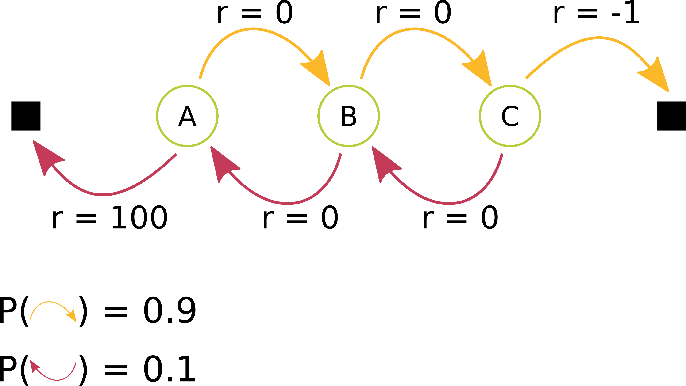

# CMPUT 566: Machine Learning - University of Alberta (Fall 2022)

This repository contains assignments, codes, and solutions from the **CMPUT 566: Machine Learning** course, taken at the **University of Alberta** in Fall 2022. The course focuses on the theory and practice of constructing algorithms that learn from data, drawing on concepts from statistics, optimization, and computer science.

  

---

## Course Overview

Machine learning is a multidisciplinary field with applications across finance, life sciences, social sciences, and medicine. This course covers both theoretical foundations and practical applications of learning algorithms.

**Topics Covered:**

- **Mathematical Foundations**
  - Random variables and probabilities
  - Optimization basics

- **Learning Paradigms**
  - Supervised, semi-supervised, and unsupervised learning
  - Bias-variance trade-off
  - Cross-validation and resampling

- **Fundamental Algorithms**
  - Parameter estimation (Maximum Likelihood, MAP)
  - Linear regression and generalized linear models
  - Linear classification (Logistic Regression, Naive Bayes, SVMs)
  - Decision trees and boosting

- **Advanced Methods**
  - Representation learning
  - Neural networks
  - Dictionary learning
  - Kernel methods
  - Bayesian linear regression

